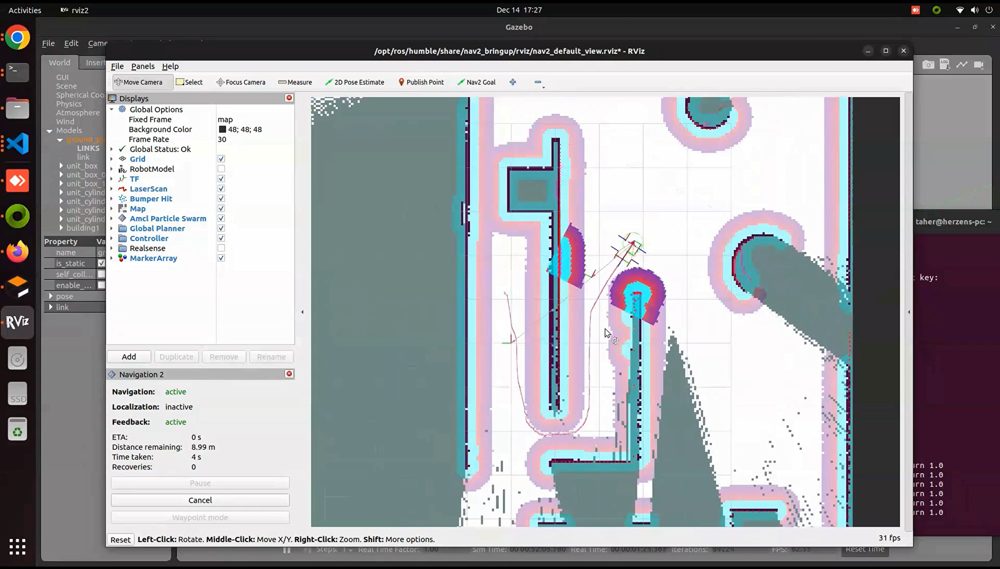
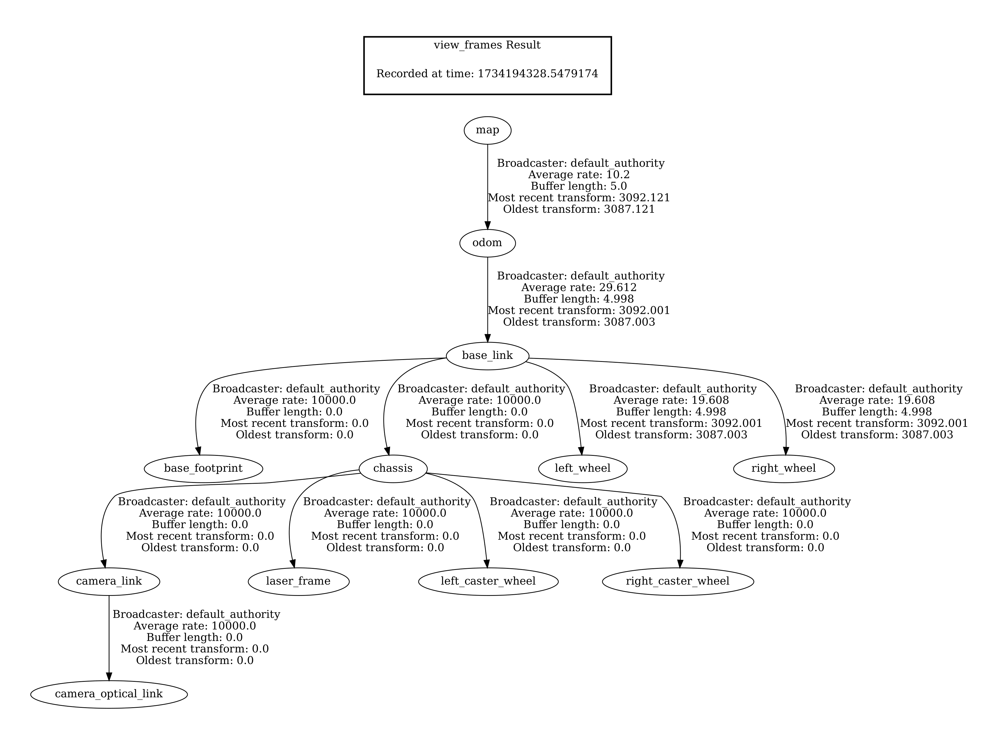

> [!NOTE]
> This README was sourced directly from [a separate guide on GitHub](https://github.com/taherfattahi/ros2-slam-auto-navigation). Needed changes will be made as we continue to build upon the project as a base. If you plan to write more comprehensive documentation (or would like to see more detailed guides), please view the official [MHSeals Documentation](https://docs.mhsroboboat.com).

## Docker Installation

Identify your chip architecture (Intel or Apple Silicon) by running `uname -m`. If you system is an Intel-based Mac, it should output `x86_64`, and if it is Apple Silicon, it will show `arm64`.

Install the following programs through your prefered method:
- [XQuartz (X server for display)](https://www.xquartz.org/)
- [Git](https://git-scm.com/downloads)
- [VSCode](https://code.visualstudio.com/)
- [Docker Desktop](https://docs.docker.com/desktop/release-notes/) 

Brew provides an easy way to install all of them at once. Start by installing Brew:
```bash
/bin/bash -c "$(curl -fsSL https://raw.githubusercontent.com/Homebrew/install/HEAD/install.sh)"
```

Now, install all of the needed packages:
```bash
brew install git --cask visual-studio-code docker xquartz
```

You will need to restart your system to use both Docker and XQuartz. If for some reason you are running a Hackintosh or a macOS VM, it is likely that Docker will complain about Hyper-V for virtualization. Depending on your setup, you will need to add these options `+vmx,+smep,+smap,+hypervisor` to your VM/boot configuration. You will likely have to troubleshoot issues, but feel free to ask questions here. 

After restarting, open XQuartz and enable `File > Preferences > Security > Allow connections from network clients`. **Each time you need to run a GUI application in the Docker container, be sure to run `xhost +` to give XQuartz access to X11 forwarding ports.** For more information, see [X11 Forwarding on macOS and Docker](https://gist.github.com/sorny/969fe55d85c9b0035b0109a31cbcb088). It may be beneficial to add a configuration to your system that runs this command automatically.

Once you have installed all the programs, open your terminal and run the following to clone the repo and open it in VSCode.

```bash
git clone -b mac https://github.com/MHSeals/mhseals_docker.git
cd mhseals_docker
code . # Open folder in VSCode
```

Once the folder is open in VSCode, install the [Dev Containers](https://marketplace.visualstudio.com/items?itemName=ms-vscode-remote.remote-containers) extension. There should be a prompt in the bottom-right corner asking if you would like to install the recommended extensions.

Finally, using `Ctrl+Shift+P`, open the command palette, and select the `Dev Containers: Open in Container` option. You are done!

## ROS2 SLAM Autonomous Navigation with SLAM Toolbox and Nav2

Use SLAM Toolbox to generate a map of the environment, then utilize the Nav2 stack for autonomous navigation within that mapped space. Rviz provides visualization of the robot, its surroundings, and ongoing navigation tasks.

### Demo Video
[](https://youtu.be/-g2nmHqZfgc?si=NTKtegcQCZkt2e99)


### Overview

This package provides:
- **Gazebo** simulation environment.
- **ROS2** Control integration to handle the robot’s joints and controllers.
- **SLAM Toolbox** for online (asynchronous) map building as the robot explores.
- **Nav2** stack to plan paths and autonomously navigate in the mapped environment.
- **Rviz2** visualization for monitoring robot state, the map, and navigation plans.

### Transform frame



### Dependencies and Setup

If you intend to run the `auto_nav` package on your local dev environment, you need to install the following. Otherwise, skip this section if you are using the Docker container.

-  Install ROS 2 Humble - [Read here](https://docs.ros.org/en/humble/Installation.html)
-  Create Workspace - [Read here](https://docs.ros.org/en/humble/Tutorials/Beginner-Client-Libraries/Creating-A-Workspace/Creating-A-Workspace.html)
-  Install XACRO 
```sh
sudo apt install ros-<distro-name>-xacro 
```
- Gazebo ROS Packages
```sh
sudo apt install ros-<distro-name>-gazebo-ros-pkgs
```
- ROS2 Control
```sh
sudo apt install ros-<distro-name>-ros2-control ros-<distro-name>-ros2-controllers ros-<distro-name>-gazebo-ros2-control
```
- SLAM Toolbox
```sh
sudo apt install ros-<distro-name>-slam-toolbox
```
- Nav2 and Twist Mux 
```sh
sudo apt install ros-<distro-name>-navigation2 sudo apt install ros-<distro-name>-nav2-bringup sudo apt install ros-<distro-name>-twist-mux
```

### Building the Package
After cloning this repository into your workspace’s ```src``` directory:
```sh
cd <your_ros2_ws>
colcon build
source install/setup.bash
```

### Usage

1. **Launch the Simulation**
Run the Gazebo simulation environment and spawn the robot:

```sh
ros2 launch auto_nav launch_sim.launch.py
```

2. **Launch SLAM and Navigation**
In a new terminal (with the workspace sourced), launch the SLAM Toolbox and Nav2 bringup with Rviz:
```sh
ros2 launch auto_nav slam_navigation.launch.py use_sim_time:=true
```

3. **Use Rviz2 for Visualization:** Rviz2 should start automatically from the second launch file. In Rviz2:
   - You can visualize the robot’s pose, sensors, and the map being built.
   - Interactively set navigation goals using the "2D Nav Goal" tool once the map and localization are stable.

4. **Autonomous Navigation:** Once you have a map (even partial), you can send navigation goals to the robot via Rviz. Nav2 will compute a path and command the robot to reach the desired destination.

### Launch Simulator-SLAM-Navigation-RViz commands individually

1. Launching the Simulation Environment
```sh
ros2 launch auto_nav launch_sim.launch.py
```
2. Starting the SLAM Toolbox (Online, Asynchronous Mode)
```sh
ros2 launch slam_toolbox online_async_launch.py use_sim_time:=true
```
3. Initializing the Navigation Stack
```sh
ros2 launch nav2_bringup navigation_launch.py use_sim_time:=True
```
4. Opening RViz with Navigation Visualization
```sh
ros2 run rviz2 rviz2 use_sim_time:=True -d /opt/ros/humble/share/nav2_bringup/rviz/nav2_default_view.rviz
```

### Troubleshooting
- **Simulation Issues:**
  Ensure that Gazebo, ROS2 Control, and joint publisher packages are correctly installed.

- **TF or Robot Description Issues:**
Check the URDF/Xacro files and the rsp.launch.py to ensure the robot description is being published correctly.

- **Navigation Errors:**
Confirm that SLAM Toolbox is running and providing a map. Ensure that Nav2 parameters match your robot’s configuration (e.g., footprint, sensor sources).

### Resources

- Robot Operating System [(ROS 2 Humble)](https://docs.ros.org/en/humble/index.html)
- ROS 2 [tf2](https://docs.ros.org/en/humble/Tutorials/Intermediate/Tf2/Introduction-To-Tf2.html)
- [ROS 2 Navigation](https://github.com/ros-navigation/navigation2/) Framework and System
- [Slam Toolbox](https://github.com/SteveMacenski/slam_toolbox) for lifelong mapping and localization in potentially massive maps with ROS
